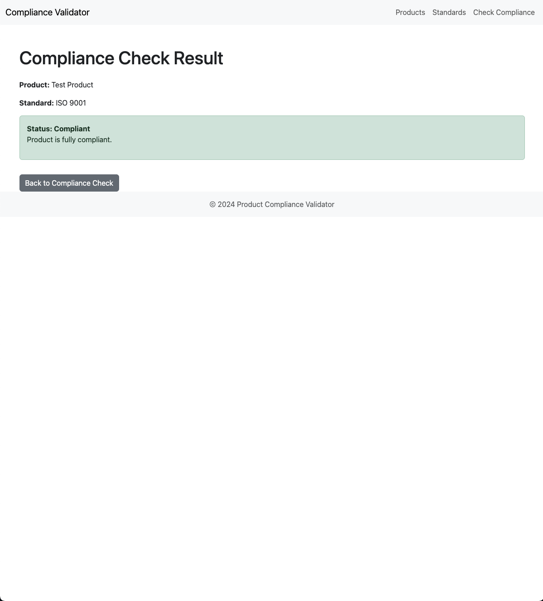

# Product Compliance Validator

## Overview
The **Product Compliance Validator** is a web-based application designed to automate and streamline compliance tracking for products. Initially developed as a Django-based system, it was later expanded into an **AI-driven risk assessment framework** to predict compliance risks and improve efficiency. This tool helps businesses ensure their products meet industry standards (e.g., ISO 9001) while reducing manual effort and improving accuracy.

---

## Key Features
- **Product Management**: Add, edit, and delete products with detailed specifications (e.g., name, description, price, weight, dimensions, material).
- **Compliance Standards Management**: Define and manage compliance standards (e.g., ISO 9001) with descriptions and actions.
- **Compliance Check**: Validate products against selected standards and receive compliance status (e.g., Compliant, Non-Compliant).
- **AI-Driven Risk Assessment**: Leverage machine learning to predict compliance risks and improve detection accuracy.
- **User-Friendly Interface**: Clean and intuitive UI for seamless navigation and efficient compliance tracking.

---

## Technologies Used
- **Backend**: Django (Python), PostgreSQL
- **Frontend**: HTML, CSS, Bootstrap
- **Machine Learning**: Python, Scikit-learn (for the AI-driven risk assessment framework)
- **Version Control**: Git

---

## How It Works
1. **Product Management**:
   - Add products with details like name, description, price, weight, dimensions, and material.
   - Edit or delete products as needed.

2. **Compliance Standards Management**:
   - Define compliance standards (e.g., ISO 9001) with descriptions.
   - Edit or delete standards as needed.

3. **Compliance Check**:
   - Select a product and a compliance standard to check if the product meets the requirements.
   - View compliance status (e.g., Compliant, Non-Compliant).

4. **AI-Driven Risk Assessment**:
   - The framework uses machine learning to predict compliance risks based on product and inspection data.
   - Provides actionable insights to prioritize high-risk products.

---

## Installation
To run this project locally, follow these steps:

### Prerequisites
- Python 3.8 or higher
- PostgreSQL
- Pip (Python package installer)

### Steps
1. Clone the repository:
   ```bash
   git clone https://github.com/your-username/product-compliance-validator.git
   cd product-compliance-validator
2. Set up a virtual environment:
   - python -m venv venv
   - source venv/bin/activate  # On Windows, use `venv\Scripts\activate`
3. Install dependencies:
   - pip install -r requirements.txt
4. Set up the database:
  
  Create a PostgreSQL database and update the settings.py file with your database credentials.
  
  Run migrations:
  - python manage.py migrate
    
5. Run the development server:


  - python manage.py runserver

6. Access the application:

  - Open your browser and go to http://127.0.0.1:8000/.

## Screenshots
*View and manage products in the system:*
  

*Define and manage compliance standards:*
  

*Check product compliance against standards:*
  

*View compliance check results:*
  


## Impact
- 40% Reduction in Manual Effort: Automating repetitive tasks like data entry and cross-referencing.

- 25% Improvement in Accuracy: AI-driven risk assessment improves compliance detection.

- 10-15 Hours Saved Per Week: Streamlined workflows save time for compliance teams.

## Future Enhancements
- Real-Time Compliance Monitoring: Integrate real-time data feeds for continuous compliance tracking.

- Advanced ML Models: Expand the AI framework to include more complex risk prediction models.

- Multi-Language Support: Add support for multiple languages to cater to global businesses.

## Contributing
### Contributions are welcome! If you'd like to contribute, please follow these steps:

1. Fork the repository.

2. Create a new branch (git checkout -b feature/YourFeatureName).

3. Commit your changes (git commit -m 'Add some feature').

4. Push to the branch (git push origin feature/YourFeatureName).

5. Open a pull request.

## License
This project is licensed under the Apache-2.0 license. See the LICENSE file for details.

## Contact
### For questions or feedback, feel free to reach out:

- Email: darrelnitereka@gmail.com

- LinkedIn: https://www.linkedin.com/in/darrel-nitereka-414452233/

- GitHub: https://github.com/DarrelN15


